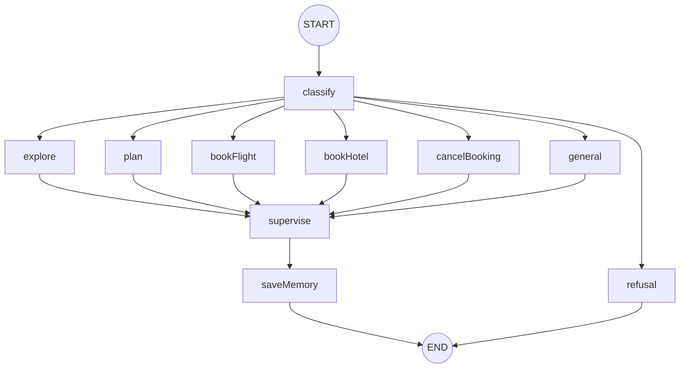
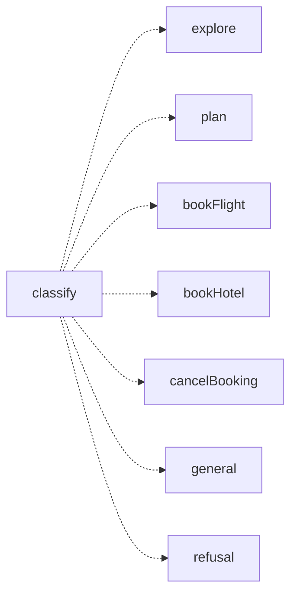
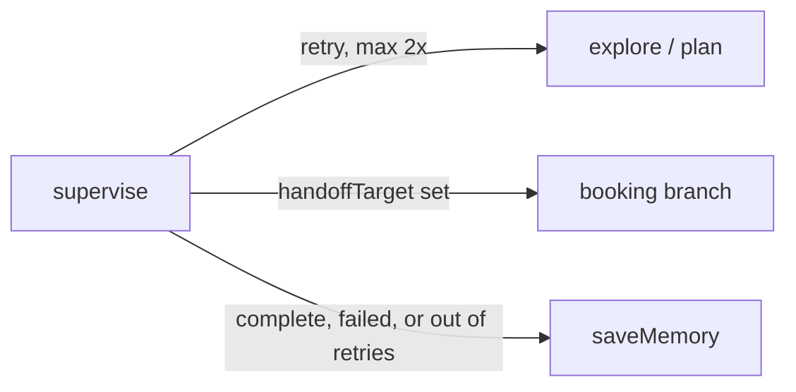

# Flow 1 — The graph: routing, branches, supervision

`apps/agent/src/agent.ts`

## The graph

One graph, a shared supervisor, six agent branches, and one deterministic refusal branch. Every
message enters through `classify` and leaves through `saveMemory` — except `out_of_scope`, which
leaves through `refusal` directly.

- **Entry** — `classify` routes on intent via `Command.goto`
- **Branches** — explore, plan, bookFlight, bookHotel, cancelBooking, general
- **Refusal** — `out_of_scope` routes straight to `refusal`, skipping supervise and saveMemory entirely
- **Retry** — explore & plan only, max 2 attempts
- **Handoff** — plan → booking branch
- **Exit** — supervise → saveMemory (best effort) → end; refusal → end directly

## Routing

`nodes/classify.ts` — a single structured-output call reads the message and routes with
`Command.goto`, every turn. No separate conditional-edge logic to keep in sync.

## Branches

`utils/create-agent.ts` — every branch is built by the same `createSpecializedAgent` factory; each
just gets its own prompt section and a restricted tool set.

| Branch        | Tools                                                   |
| ------------- | ------------------------------------------------------- |
| explore       | destinations · places · local tips · RAG knowledge base |
| plan          | flights · hotels · routes · weather                     |
| bookFlight    | revalidate → human approval → submit                    |
| bookHotel     | revalidate → human approval → submit                    |
| cancelBooking | retrieve → human approval → cancel                      |
| general       | open travel conversation, no side effects               |

## Refusal

`nodes/refusal.ts` — not built by `createSpecializedAgent`: a plain function, no model call, no
tools. `classify` already produces a language-matched `refusalMessage` in its one structured-output
call whenever it classifies `out_of_scope`; `refusal` just replies with that message and ends the
turn, bypassing `supervise` and `saveMemory`.

## Supervision

`nodes/supervise.ts` — every branch, not just booking, flows into `supervise`. It validates the
result, then `routeAfterSupervisor` decides what happens next.

> A booking that times out is marked `WRITE_STATUS_UNKNOWN` and never auto-retried — the side effect
> may already have happened, so it isn't worth guessing on.
