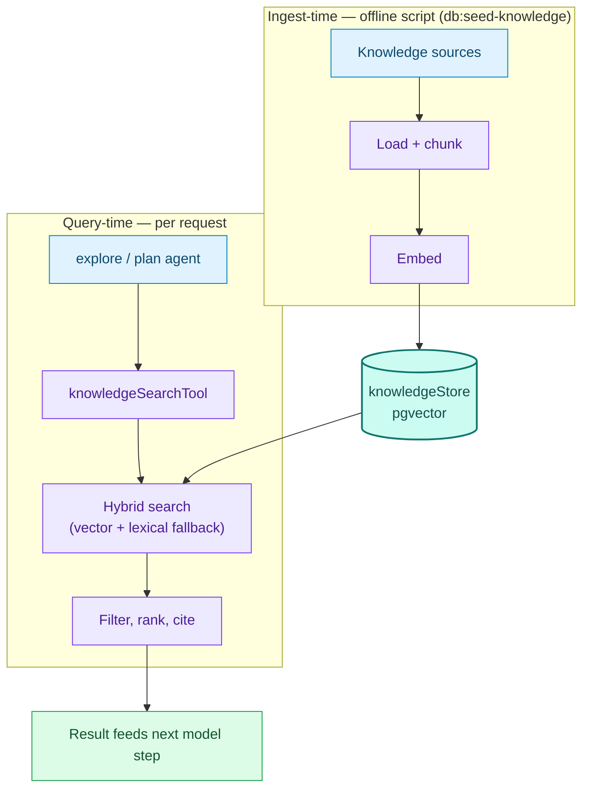

# Flow 2 — RAG (knowledge base)

Grounds `explore` / `plan` answers in real documents instead of model improvisation.

**Key files**: `knowledge/sources.ts`, `knowledge/loader.ts`, `knowledge/ingestion.ts`,
`knowledge/retrieval.ts`, `tools/knowledge.ts`, `infrastructure/persistence/knowledge-store.ts`.
