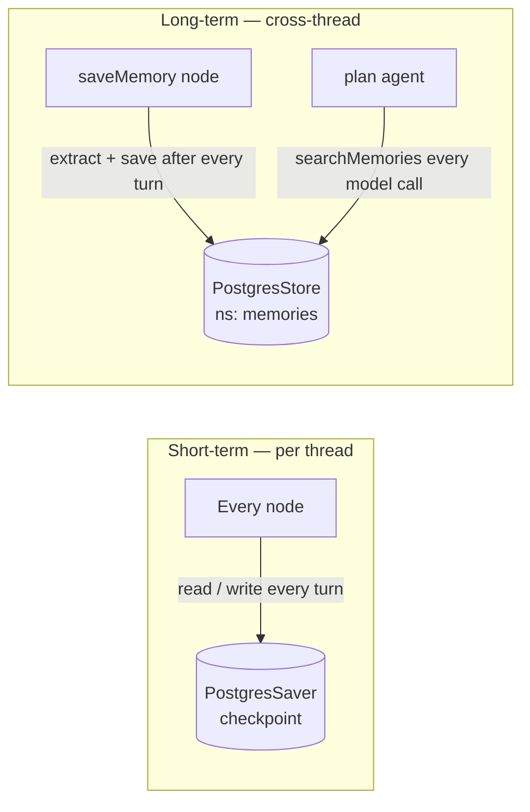

# Flow 3 — Long-term memory

Two memories, two lifetimes.

- **Short-term** — every node reads/writes the PostgresSaver checkpoint each turn.
- **Long-term** — `saveMemory` extracts preferences after every turn into `PostgresStore`; `plan`
  calls `searchMemories()` on every model call to recall them.

**Key files**: `nodes/save-memory.ts`, `services/memory.ts`, `infrastructure/persistence/memory-store.ts`,
`utils/create-agent.ts`.
