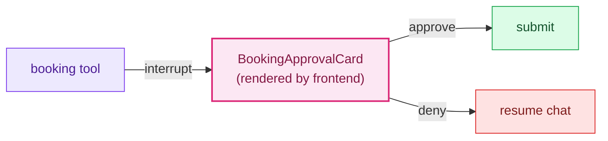

# Flow 4 — Booking handoff & human-in-the-loop

## Handoff, validated

`tools/handoffs.ts` · `nodes/supervise.ts` — `transferToBookFlightTool` / `transferToBookHotelTool`
just set `handoffTarget` in state; they don't jump the graph. Supervise reads that field once plan
finishes and routes straight to the booking branch.

```mermaid
flowchart LR
    Plan[plan agent] -->|transferToBookFlightTool| Set["handoffTarget = bookFlight"]
    Set --> Supervise[supervise]
    Supervise --> Book[bookFlight agent]
    Book -->|bookFlightTool| Interrupt["interrupt(): wait approval"]
    Interrupt -->|approved| Confirmed[Booking confirmed]

    classDef agent fill:#ede9fe,stroke:#7c3aed,color:#4c1d95
    classDef routing fill:#dbeafe,stroke:#2563eb,color:#1e3a8a
    classDef control fill:#ffedd5,stroke:#ea580c,color:#7c2d12,stroke-width:2px
    classDef success fill:#dcfce7,stroke:#16a34a,color:#14532d

    class Plan,Book agent
    class Set routing
    class Supervise,Interrupt control
    class Confirmed success
```

## Human in the loop

`utils/booking-approval.ts` (`requestBookingApproval`) · `hooks/useBookingAction.tsx` — booking and
cancellation tools call `interrupt()` mid-execution. The graph pauses, the frontend renders an
approval card, and the tool only continues once a human responds.

> The interaction is intentionally synchronous: the graph is paused state, not a background job — so
> a reload or a slow reviewer never loses the pending decision.
