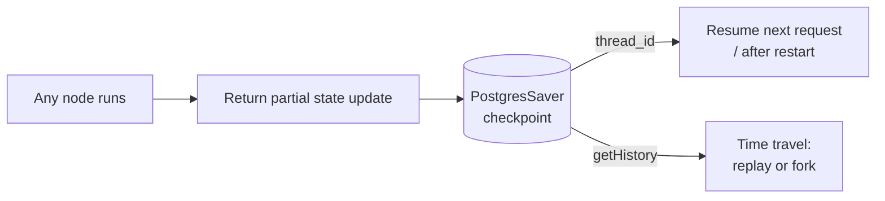
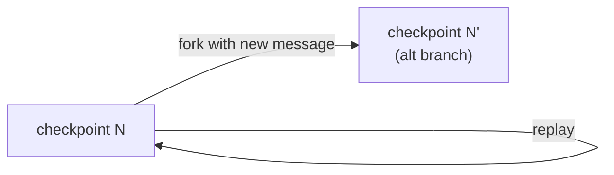

# Flow 5 — Checkpoints & time travel

Every state update rides on a checkpoint. Selected flight, hotel, and place IDs live in state
(`flights`, `hotel`, `selectedOptions`) and are checkpointed via `PostgresSaver`, persisting across
the deployed app until the Itinerary Summary is generated.

`TimeTravelPanel` (frontend) reads a thread's checkpoint history and lets you replay from one, or
fork by injecting a new message at that point — old branch stays, new branch starts from the same
checkpoint.

**Key files**: `apps/agent/src/agent.ts` (`PostgresSaver.fromConnString`),
`apps/web/src/components/chat/TimeTravelPanel/index.tsx` (`threads.getHistory`, `runs.wait`).
