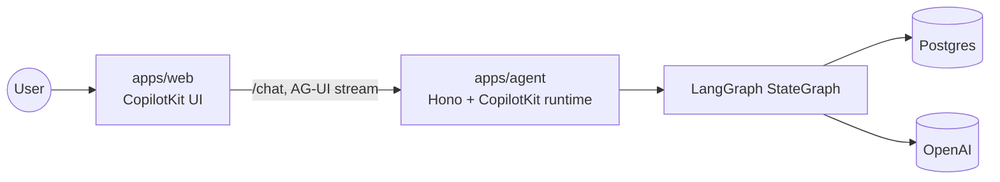

# Flow diagrams — for demo

| #   | Flow                                      | File                                                                 |
| --- | ----------------------------------------- | -------------------------------------------------------------------- |
| 1   | The graph: routing, branches, supervision | [01-intent-routing-supervisor.md](./01-intent-routing-supervisor.md) |
| 2   | RAG (knowledge base)                      | [02-rag-knowledge.md](./02-rag-knowledge.md)                         |
| 3   | Long-term memory                          | [03-long-term-memory.md](./03-long-term-memory.md)                   |
| 4   | Booking handoff & human-in-the-loop       | [04-booking-handoff-hitl.md](./04-booking-handoff-hitl.md)           |
| 5   | Checkpoints & time travel                 | [05-time-travel.md](./05-time-travel.md)                             |

## System overview

Postgres backs three roles, one connection string (`POSTGRES_URL`):

- **Checkpointer** → per-turn graph state → [time travel](./05-time-travel.md)
- **Memory store** → cross-thread facts → [long-term memory](./03-long-term-memory.md)
- **Knowledge store** (pgvector) → grounded answers → [RAG](./02-rag-knowledge.md)
